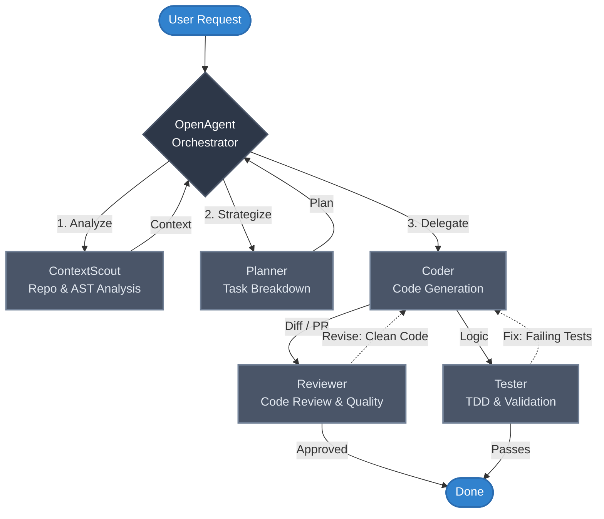
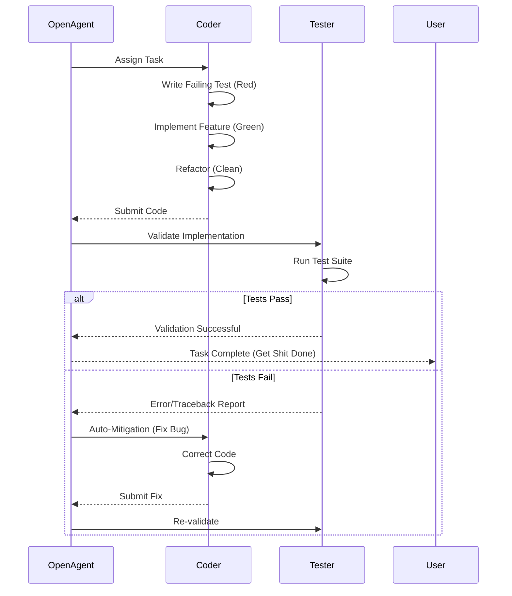
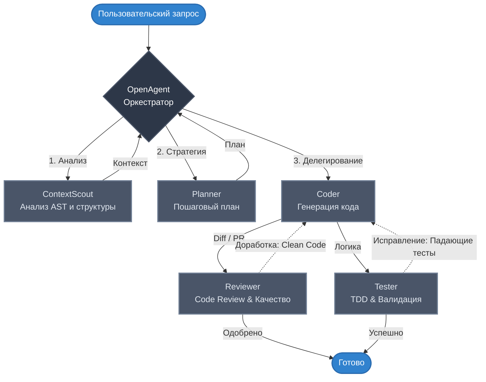
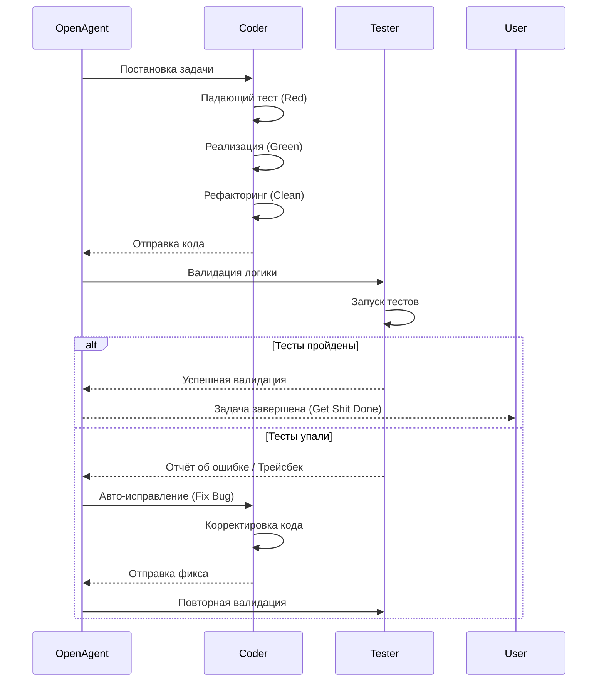

<p align="center">
  
</p>

# CodeAtlas-Lite

[🇷🇺 Русский](#codeatlas-lite-русский) | [🇬🇧 English](#codeatlas-lite-english)

---

<a name="codeatlas-lite-english"></a>
## 🇬🇧 CodeAtlas-Lite (English)

> **High-Performance Multi-Agent Orchestration Framework**

CodeAtlas-Lite is the public open-core version of the powerful **CodeAtlas** agentic ecosystem. It is an advanced autonomous multi-agent orchestration engine designed to turn large language models into highly capable, autonomous software engineering teams. 

Unlike basic agent wrappers, CodeAtlas implements a strictly enforced **deterministic delegation workflow**: agents don't just chat; they analyze, plan, route, execute, and validate in a structured pipeline.

### Core Principles and Capabilities

CodeAtlas is built on a foundation of strict operational rules to prevent LLM hallucinations and endless loops.

- **"Get Shit Done" Philosophy:** A focus on minimal, high-signal changes over broad rewrites. Agents are instructed to be concise, to strictly adhere to done criteria, and to provide actionable outcomes rather than generic conversational filler.
- **Smart Problem Solving:** A built-in fail-fast safety net. Before attempting a blind fix, agents analyze errors, categorize them (User Error, Environmental, Internal Tooling), and apply specific mitigation strategies rather than jumping to alternatives without understanding the root cause.
- **True Agent-to-Agent Delegation:** Tasks are automatically routed. `OpenAgent` acts as an orchestrator, delegating complex system analysis to `ContextScout`, writing tasks to `Planner` and `Coder`, and validation to `Reviewer` and `Tester`.
- **TDD Protocol (Elite Mode):** For any new function, the `Coder` agent strictly enforces a RED-GREEN-REFACTOR cycle, writing a failing test before implementation.
- **Auto-Mitigated Feedback Loops:** If `Reviewer` or `Tester` agents detect anomalies in the `Coder`'s logic, the workflow does not stop. The orchestrator automatically routes the errors back to the `Coder` for up to two revision cycles.
- **Anti-Hang Protocol:** Prevents LLMs from getting stuck in endless thinking processes. Execution paths are bounded by strict step limits and "Fail Fast" timeouts.
- **Context-Aware UI-Localization:** If UI elements are generated, agents dynamically check project settings or prompt the user for the targeted UI language to prevent default English layouts for regional apps.
- **AST-Driven Code Perception:** Not just grep. Powered by the compiled `ast-index` executable and `repomap`, CodeAtlas truly understands your codebase topology, class hierarchies, and call graphs.
- **Strict Runtime Governance:** Workflows are governed by strict Markdown contracts and validation scripts ensuring serial, deterministic execution.
- **Zero-Mistake Protocol:** Agents do not guess. If an API is unknown, they search documentation. If an error is misunderstood, they trace it. The goal is to produce correct code on the first attempt, minimizing sloppy iterative fixing.
- **Fail-Safe Auto-Backups:** Before mutating existing logic or critical files, the Coder agent automatically creates a `.bak` copy of the original file to ensure zero data loss during autonomous operations.
- **Persistent Cognitive Memory ([EchoVault](https://github.com/coalaura/echo-vault)):** Through deep Model Context Protocol (MCP) integration with EchoVault, CodeAtlas maintains long-term memory and context across sessions, ensuring agents are aware of previous architectural setups and decisions without starting from scratch.
- **Pluggable Skill System:** Easily extend capabilities. "Skills" define language-specific nuances or external tool integrations injected directly into the agent context dynamically.

### Architecture

#### Orchestration Workflow



#### TDD Cycle & Fail-Fast Mechanism



#### The Lite Repository Structure

```text
CodeAtlas-Lite/
├── agents/                           # Core configuration prompts for agents
│   ├── openagent.md                  # Main routing and delegation orchestrator
│   ├── contextscout.md               # Repo-wide analysis and topology crawler
│   ├── planner.md                    # Strategic step-by-step task breakdown
│   ├── coder.md                      # Code generation and file modification 
│   ├── reviewer.md                   # Diff analysis and standard enforcement
│   └── tester.md                     # Test generation and execution validation
├── skills/                           # Extensible tooling and patterns
│   ├── ast-index/SKILL.md            # Execution profiles for the AST indexer
│   ├── repomap/SKILL.md              # PageRank-based architecture mapping
│   ├── python/SKILL.md               # Baseline language guidelines
│   └── typescript/SKILL.md           # Baseline language guidelines
├── bin/                              # Executables (e.g., ast-index.exe)
├── opencode.json                     # Generic runtime LLM configuration manifest
├── dcp.jsonc                         # Deterministic Context Protocol configuration
├── validate-runtime-governance.mjs   # Strict CI/CD prompt constraint validator
└── README.md                         # Project documentation
```

### Curated MCP Integrations (Lite)

To keep the Lite version lean and avoid unnecessary telemetry or redundant access protocols, bloated integrations like `filesystem` or generic `memory` have been intentionally excluded. Instead, CodeAtlas-Lite ships with highly targeted MCP servers:

- **Tavily Search (`tavily-search`):** Replacing basic integrations like DuckDuckGo for robust, research-grade web searches.
- **Context7 (`context7`):** Seamless real-time documentation retrieval for external libraries.
- **GitHub Grep (`github-grep`):** Fast pattern matching across external open-source codebases.

### Getting Started

#### Installation

**CodeAtlas runs entirely out of your global configuration directory.**

1. Clone the repository:
   ```bash
   git clone https://github.com/Harbuzilia/CodeAtlas.git
   ```

2. **CRITICAL STEP:** Copy all the files and folders from this repository directly into your system's global `opencode` configuration directory, *maintaining the exact internal folder structure*. `opencode.json` must be at the root of the configuration directory at this precise path:
   - **Windows:** `C:\Users\Your_Username\.config\opencode\opencode.json`
   - **macOS / Linux:** `~/.config/opencode/opencode.json`

   *Note: The core engine config logic explicitly looks for the `opencode` folder name and requires the global configuration manifest to be exactly at this path.*

3. Set up the AST Executable:
   The `ast-index` tool uses a compiled executable to parse repository structures near-instantly. You can download or build it from [Claude-ast-index-search](https://github.com/defendend/Claude-ast-index-search). You must place your compiled `ast-index.exe` (or binary equivalent for Linux/macOS) into the global `bin/` directory:
   - Path: `~/.config/opencode/bin/ast-index.exe`

4. Configure your API key. Edit `opencode.json` in the configuration directory to add your model endpoints and OpenRouter API key.

5. Initialize in a specific project:
   From your target workspace, run:
   ```bash
   bash ~/.config/opencode/opencode-init.sh
   ```

6. Run CodeAtlas:
   Start interacting with your terminal wrapper or UI tool configured to point to these agents!

### Knowledge Sharing & Showcase

This repository houses the **CodeAtlas-Lite** engine. It is a fully functional slice of the architecture providing immense value for single developers and open-source experiments.

I built CodeAtlas to explore the limits of deterministic autonomous agents. If you want to see how the extended architecture operates in a real enterprise environment (with 50+ enterprise skills, dynamic migrations, and advanced agents), or if you want to understand how to expand this ecosystem, feel free to reach out.

**Contact the repository owner to discuss advanced implementations, view demonstrations, or collaborate on pushing agentic architecture forward.**

---

<br><br>

<a name="codeatlas-lite-русский"></a>
## 🇷🇺 CodeAtlas-Lite (Русский)

> **Высокопроизводительный фреймворк для оркестрации мультиагентных систем**

CodeAtlas-Lite — это публичная open-core версия мощной экосистемы агентов **CodeAtlas**. Это продвинутый автономный движок оркестрации, созданный для превращения больших языковых моделей (LLM) в высококвалифицированные автономные команды разработчиков ПО.

В отличие от простых оберток над агентами, CodeAtlas применяет строго контролируемый **детерминированный рабочий процесс делегирования**: агенты не просто болтают; они анализируют, планируют, маршрутизируют, выполняют и проверяют код в структурированном конвейере.

### Основные принципы и возможности

CodeAtlas построен на базе строгих операционных правил для предотвращения галлюцинаций LLM и бесконечных циклов.

- **Философия "Get Shit Done":** Фокус на минимальных, высокосигнальных изменениях вместо масштабных переписываний. Агенты проинструктированы быть краткими, строго соблюдать критерии готовности (done criteria) и выдавать практические результаты вместо шаблонной болтовни.
- **Умное решение проблем:** Встроенная система безопасности "fail-fast". Прежде чем пытаться применить слепое исправление, агенты анализируют ошибки, классифицируют их (ошибка пользователя, проблемы среды, внутренний инструментарий) и применяют конкретные стратегии по устранению вместо прыжков по случайным альтернативам без понимания первопричины.
- **Истинное делегирование между агентами:** Задачи распределяются автоматически. `OpenAgent` выступает в роли оркестратора, делегируя анализ системы агенту `ContextScout`, написание логики — `Planner` и `Coder`, а проверку — `Reviewer` и `Tester`.
- **Протокол TDD (Elite Mode):** Для любой новой функции агент `Coder` строго соблюдает цикл RED-GREEN-REFACTOR, обязательно пишущий падающий тест перед реализацией фичи.
- **Петли обратной связи (Feedback Loops):** Если `Reviewer` или `Tester` находят ошибки в логике, процесс не останавливается. Оркестратор автоматически заворачивает ошибки обратно к `Coder` на доработку (до двух циклов ревизии).
- **Anti-Hang протокол:** Предотвращает зависание LLM в бесконечных "раздумьях". Пути выполнения ограничены строгими лимитами шагов и таймаутами.
- **Контекстно-зависимая локализация UI:** Если генерируются элементы интерфейса, агенты динамически проверяют настройки проекта или запрашивают целевой язык UI, чтобы предотвратить создание английских интерфейсов по-умолчанию для региональных приложений.
- **Восприятие кода через AST:** Это не просто grep. Благодаря скомпилированному исполняемому файлу `ast-index` и `repomap`, CodeAtlas по-настоящему понимает топологию вашей кодовой базы, иерархию классов и графы вызовов.
- **Строгое управление в Runtime:** Рабочие процессы регулируются строгими контрактами в формате Markdown и валидационными скриптами, гарантирующими последовательное, детерминированное выполнение.
- **Zero-Mistake протокол:** Агенты не угадывают. Если API неизвестно, они ищут документацию. Если ошибка непонятна, они анализируют стек вызовов. Цель — писать правильный код с первой попытки, минимизируя небрежные последовательные исправления.
- **Fail-Safe авто-бэкапы:** Перед изменением рабочей логики или критически важных файлов агент Coder автоматически создает резервную копию оригинала (`.bak`), гарантируя безопасность данных при автономной работе.
- **Долгосрочная память ([EchoVault](https://github.com/coalaura/echo-vault)):** За счет глубокой интеграции Model Context Protocol (MCP) с EchoVault, CodeAtlas сохраняет долговременную память и контекст между сессиями. Агенты знают о предыдущих архитектурных решениях и настройках без необходимости начинать каждый раз с нуля.
- **Плагинная система "Навыков" (Skills):** Легко расширяет возможности. Навыки определяют нюансы конкретного языка или интеграцию с внешними инструментами, которые динамически "впрыскиваются" в контекст агента.

### Архитектура (Architecture)

#### Оркестрация рабочего процесса (Workflow)



#### TDD Цикл и механизм Fail-Fast



### Структура репозитория Lite

Все файлы в репозитории (папки `agents`, `skills`, `bin` и файлы `opencode.json`, `dcp.jsonc`, `validate-runtime-governance.mjs`) представляют собой строгую структуру конфигурации, которая должна быть сохранена целиком при установке.

### Интеграции MCP (Lite)

Чтобы версия Lite оставалась легковесной и избегала излишней телеметрии или ненужных протоколов доступа, перегруженные интеграции вроде обычного `filesystem` или примитивной `memory` были намеренно исключены. CodeAtlas-Lite поставляется с узконаправленными MCP-серверами:

- **Tavily Search (`tavily-search`):** Заменяет базовые интеграции вроде DuckDuckGo на мощный поиск исследовательского уровня.
- **Context7 (`context7`):** Обеспечивает бесшовное получение актуальной документации для внешних библиотек в реальном времени.
- **GitHub Grep (`github-grep`):** Быстрый поиск паттернов по открытым чужим кодовым базам (open-source).

### Начало работы

#### Установка

**CodeAtlas запускается исключительно из вашей глобальной папки конфигурации.**

1. Склонируйте репозиторий:
   ```bash
   git clone https://github.com/Harbuzilia/CodeAtlas.git
   ```

2. **КРИТИЧЕСКИЙ ШАГ:** Скопируйте **все** файлы и папки из этого репозитория напрямую в глобальную конфигурационную директорию вашей системы `opencode`, *строго сохраняя внутреннюю структуру папок*. Файл `opencode.json` должен оказаться в корне конфигурационной директории по следующему точному пути:
   - **Windows:** `C:\Users\Имя_вашего_пользователя\.config\opencode\opencode.json`
   - **macOS / Linux:** `~/.config/opencode/opencode.json`

   *Важно: логика конфигурации ядра обращается к точному названию папки `opencode` и требует, чтобы глобальный манифест находился именно по этому пути. Остальные папки репозитория (`agents`, `skills`) тоже должны лежать рядом с `opencode.json` внутри `~/.config/opencode/`.*

3. Установите исполняемый файл AST:
   Инструмент `ast-index` использует скомпилированный файл для почти мгновенного парсинга структур репозиториев (можно скачать или собрать тут: [Claude-ast-index-search](https://github.com/defendend/Claude-ast-index-search)). Вам необходимо поместить скомпилированный `ast-index.exe` (или аналог для Linux/macOS) в глобальную папку `bin/`:
   - Путь: `~/.config/opencode/bin/ast-index.exe`

4. Настройте ваш API ключ. Отредактируйте `opencode.json` в папке с конфигурацией, указав необходимые эндпоинты моделей и ваш API ключ OpenRouter.

5. Инициализация в конкретном проекте:
   Находясь в вашей рабочей директории, выполните:
   ```bash
   bash ~/.config/opencode/opencode-init.sh
   ```

6. Запуск CodeAtlas:
   Начинайте работу через ваш CLI wrapper или UI-инструмент (например, Aider), настроенный на эти конфигурации агентов!

### Обмен знаниями и демонстрация

Этот репозиторий содержит движок **CodeAtlas-Lite**. Это полностью функциональный срез архитектуры, дающий огромную ценность для одиночных разработчиков и open-source экспериментов. Полная внутренняя реализация (Extended) включает в себя расширенные агенты (Debugger, DocWriter, ExternalScout), библиотеку из 50+ enterprise-навыков, безопасность, динамические миграции и многое другое.

Я создал CodeAtlas для исследования границ детерминированных автономных агентов. Если вы хотите увидеть, как расширенная архитектура работает в реальной enterprise-среде, или хотите понять, как расширить эту экосистему новыми инструментами, я открыт к диалогу.

**Свяжитесь с владельцем репозитория, чтобы обсудить продвинутые внедрения, посмотреть демонстрации или посотрудничать в развитии агентной архитектуры.**

---

## Contributing
We welcome issues, PRs, and feature ideas for the Lite engine. Read our [CONTRIBUTING.md](CONTRIBUTING.md) for details on code of conduct and the pull request process.

## License
This project is licensed under the MIT License - see the [LICENSE](LICENSE) file for details.
