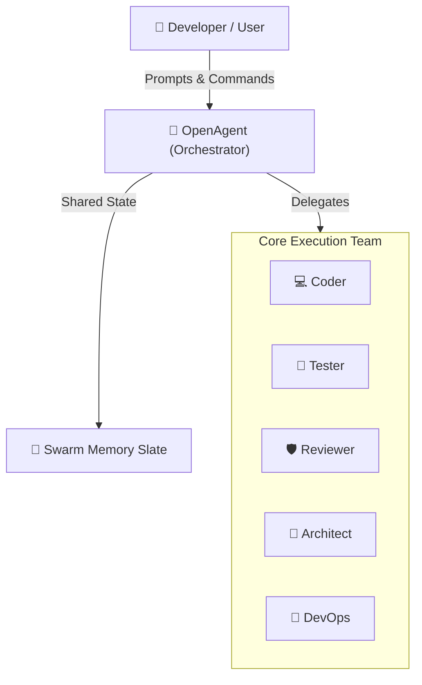

# Architecture Command | Команда /arch

## Назначение
Сформировать актуальную, живую архитектурную карту системы на базе AST-анализа исходного кода, роутов, DTO, БД и Docker-манифестов.

## Вход
- `/arch` — полная генерация C4 диаграмм проекта
- `/arch <модуль>` — локальная диаграмма компонентов для выбранной подсистемы

## Пример вывода
```markdown
## 🏛️ Архитектурная карта системы (C4 Model)


```
