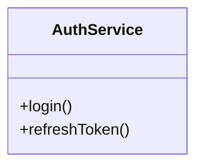

# DocGen Command | Команда /docgen

## Назначение
Автоматически сгенерировать исчерпывающую техническую документацию для модуля или директории прямо из AST исходного кода (экспорты, методы, параметры, типы и диаграммы взаимосвязей).

## Вход
- `/docgen <путь/директория>` (например, `/docgen scripts/` или `/docgen src/services`)
- `/docgen` без аргументов — документация по ключевым сервисам проекта

## Автоматический режим
1. Сканировать файлы в указанной директории.
2. Извлечь классы, интерфейсы, функции и их JSDoc / docstrings.
3. Сгенерировать Mermaid class-диаграмму.
4. Сохранить документацию в `docs/modules/<module-name>.md` или вывести в чат.

## Пример вывода
```markdown
## 📖 Документация модуля: `AuthService`

### Экспортируемые функции:
- `login(credentials: LoginDTO): Promise<AuthToken>`
- `refreshToken(token: string): Promise<AuthToken>`

### Mermaid диаграмма:

```
