# System Architecture Map (Live C4 Container & Workflow Model)

*Generated automatically via `npm run arch` on 2026-09-16.*

## 1. High-Level Agent & Subsystem Interactions

```mermaid
graph TD
    User["Developer"] -->|"Slash Commands & Natural Language"| OpenAgent["openagent (Orchestrator)"]
    architect["architect"]
    coder["coder"]
    contextscout["contextscout"]
    debugger["debugger"]
    devops["devops"]
    docwriter["docwriter"]
    externalscout["externalscout"]
    planner["planner"]
    reviewer["reviewer"]
    tester["tester"]
    uitester["uitester"]
    cmd_arch["/arch"]
    cmd_bootstrap["/bootstrap"]
    cmd_budget["/budget"]
    cmd_build-context-system["/build-context-system"]
    cmd_commit["/commit"]
    cmd_conflict["/conflict"]
    cmd_docgen["/docgen"]
    cmd_doctor["/doctor"]
    cmd_heal["/heal"]
    cmd_i18n["/i18n"]
    cmd_infra["/infra"]
    cmd_matrix["/matrix"]
    cmd_modernize["/modernize"]
    cmd_optimize["/optimize"]
    cmd_oracle["/oracle"]
    cmd_plan["/plan"]
    cmd_pr["/pr"]
    cmd_prompt["/prompt"]
    cmd_prompt-engineering/prompt-optimizer["/prompt-engineering/prompt-optimizer"]
    cmd_release["/release"]
    cmd_review["/review"]
    cmd_synthesize["/synthesize"]
    cmd_test["/test"]
    skill_api-change-safe["api-change-safe"]
    skill_api-openapi-spec["api-openapi-spec"]
    skill_architecture-adr["architecture-adr"]
    skill_ast-index["ast-index"]
    skill_caching-redis-strategy["caching-redis-strategy"]
    skill_code-modernization-patterns["code-modernization-patterns"]
    skill_config-migration["config-migration"]
    skill_context7["context7"]
    skill_csharp["csharp"]
    skill_database-sql["database-sql"]
    skill_db-migration-safety["db-migration-safety"]
    skill_devops-docker["devops-docker"]
    skill_docs-sync["docs-sync"]
    skill_e2e-playwright["e2e-playwright"]
    skill_event-driven-messaging["event-driven-messaging"]
    skill_feature-flags-trunk-based["feature-flags-trunk-based"]
    skill_frontend-design["frontend-design"]
    skill_git["git"]
    skill_git-conflict-resolution["git-conflict-resolution"]
    skill_grpc-graphql-contracts["grpc-graphql-contracts"]
    skill_i18n-localization["i18n-localization"]
    skill_incident-response["incident-response"]
    skill_micro-frontends-federation["micro-frontends-federation"]
    skill_mock-service-virtualization["mock-service-virtualization"]
    skill_observability-opentelemetry["observability-opentelemetry"]
    skill_performance-optimization["performance-optimization"]
    skill_prompt-engineering-advanced["prompt-engineering-advanced"]
    skill_python["python"]
    skill_react-next-modern["react-next-modern"]
    skill_repomap["repomap"]
    skill_review-code-checklist["review-code-checklist"]
    skill_review-code-strategy["review-code-strategy"]
    skill_secrets-config-management["secrets-config-management"]
    skill_security-owasp["security-owasp"]
    skill_security-sast["security-sast"]
    skill_typescript["typescript"]
    skill_websocket-realtime-events["websocket-realtime-events"]
coder --> reviewer
reviewer --> tester
contextscout --> externalscout
externalscout --> coder
coder --> tester
tester --> docwriter
```

## 2. Inventory (generated from disk)
- Agents: 12 (architect, coder, contextscout, debugger, devops, docwriter, externalscout, openagent, planner, reviewer, tester, uitester)
- Slash commands: 23 (/arch, /bootstrap, /budget, /build-context-system, /commit, /conflict, /docgen, /doctor, /heal, /i18n, /infra, /matrix, /modernize, /optimize, /oracle, /plan, /pr, /prompt, /prompt-engineering/prompt-optimizer, /release, /review, /synthesize, /test)
- Skills: 37 (api-change-safe, api-openapi-spec, architecture-adr, ast-index, caching-redis-strategy, code-modernization-patterns, config-migration, context7, csharp, database-sql, db-migration-safety, devops-docker, docs-sync, e2e-playwright, event-driven-messaging, feature-flags-trunk-based, frontend-design, git, git-conflict-resolution, grpc-graphql-contracts, i18n-localization, incident-response, micro-frontends-federation, mock-service-virtualization, observability-opentelemetry, performance-optimization, prompt-engineering-advanced, python, react-next-modern, repomap, review-code-checklist, review-code-strategy, secrets-config-management, security-owasp, security-sast, typescript, websocket-realtime-events)
- Delegation edges from functional_modes table: 6
