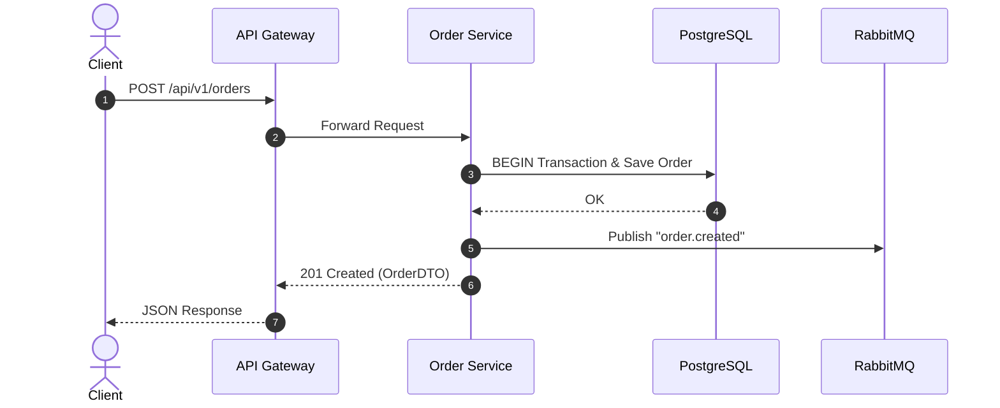
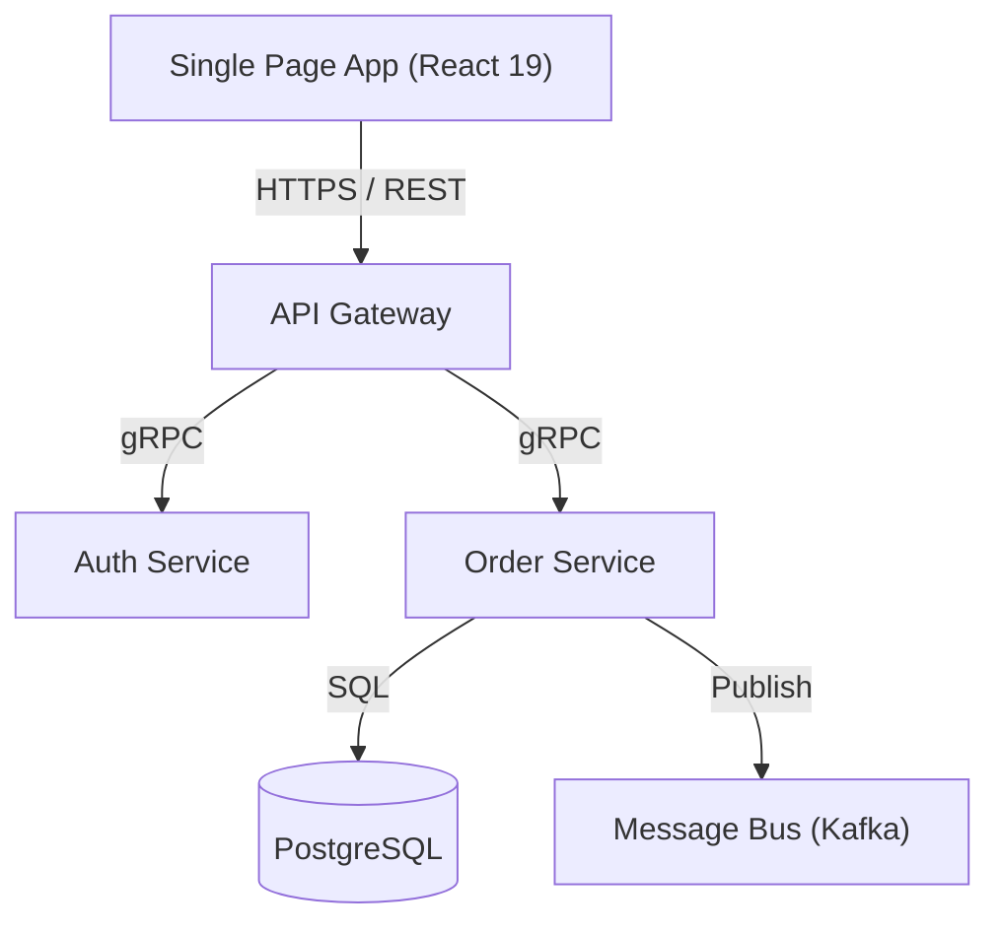

# Architecture & ADR Skill

<context>
Этот скилл содержит стандарты оформления архитектурных решений (ADR), проектирования распределенных систем, микросервисов, очередей сообщений и C4-диаграмм.
Используется агентами `architect`, `planner` и `reviewer`.
</context>

## 1. Структура Architecture Decision Record (ADR)

Файлы ADR сохраняются в директорию `docs/adr/` с именем `NNN-title.md` (например, `docs/adr/001-use-postgresql-for-orders.md`):

```markdown
# ADR-001: Выбор PostgreSQL в качестве основной БД заказов

## Статус
Принято (Accepted) | Дата: 2026-08-22

## Контекст и постановка проблемы
Сервис заказов требует строгих ACID-гарантий при транзакционном списании средств и остатков со склада. Ожидаемая нагрузка: 2000 RPS на чтение, 400 RPS на запись.

## Рассмотренные альтернативы
1. MongoDB — высокая гибкость документов, но слабее ACID в распределенных транзакциях.
2. PostgreSQL 16 — строгие транзакции, поддержка JSONB, зрелая экосистема, партиционирование.
3. DynamoDB — высокая масштабируемость, но сложнее строить аналитические отчеты.

## Решение
Выбран **PostgreSQL 16** с connection pooling (PgBouncer) и репликацией Read-Replica.

## Последствия и компромиссы
### Позитивные:
- Строгая консистентность данных.
- Поддержка транзакций уровня Serializable.
### Негативные / Риски:
- Необходимость управления миграциями (Flyway/EF Core Migrations).
- Требуется мониторинг размера WAL-логов и vacuuming.
```

---

## 2. Диаграммы C4 и Sequence (Mermaid)

### Sequence Diagram


### C4 Container Diagram


---

## 3. Чек-лист архитектурного ревью

- [ ] Четко сформулирован контекст и бизнес-требования
- [ ] Описаны минимум 2 альтернативы с обоснованием выбора
- [ ] Зафиксированы компромиссы (Trade-offs) и риски
- [ ] Добавлена наглядная Mermaid диаграмма
- [ ] Согласованы контракты API и модель данных
